# Diagrama entidad-relación definitivo

## Propósito

Este diagrama representa el modelo lógico aprobado para la primera versión de la tienda. Es un diseño previo a Prisma: los nombres pueden ajustarse durante la implementación, pero las relaciones, snapshots históricos e invariantes no deben alterarse sin revisar las reglas de negocio.

```mermaid
erDiagram
    USER ||--o{ USER_ROLE : posee
    ROLE ||--o{ USER_ROLE : asigna
    USER ||--o{ SESSION : inicia
    USER ||--o{ ADDRESS : guarda
    USER ||--o{ CART : posee
    USER o|--o{ ORDER : realiza
    USER ||--o{ REVIEW : publica
    USER ||--o{ INVENTORY_MOVEMENT : ejecuta
    USER o|--o{ ORDER_STATUS_HISTORY : cambia

    CATEGORY o|--o{ CATEGORY : contiene
    BRAND ||--o{ PRODUCT : identifica
    PRODUCT ||--o{ PRODUCT_CATEGORY : clasifica
    CATEGORY ||--o{ PRODUCT_CATEGORY : agrupa
    PRODUCT ||--o{ PRODUCT_IMAGE : muestra
    PRODUCT ||--o{ PRODUCT_VARIANT : ofrece
    PRODUCT o|--o| INVENTORY : controla
    PRODUCT_VARIANT o|--o| INVENTORY : controla
    INVENTORY ||--o{ INVENTORY_MOVEMENT : registra

    CART ||--|{ CART_ITEM : contiene
    PRODUCT o|--o{ CART_ITEM : agrega
    PRODUCT_VARIANT o|--o{ CART_ITEM : selecciona

    ORDER ||--|{ ORDER_ITEM : conserva
    ORDER ||--|{ ORDER_STATUS_HISTORY : historiza
    ORDER ||--o{ PAYMENT : cobra
    ORDER ||--o| SHIPMENT : despacha
    PRODUCT o|--o{ REVIEW : recibe

    USER {
        uuid id PK
        string email UK
        string password_hash
        string status
        datetime email_verified_at
    }
    ROLE {
        uuid id PK
        string name UK
        string description
    }
    USER_ROLE {
        uuid user_id FK
        uuid role_id FK
    }
    SESSION {
        uuid id PK
        uuid user_id FK
        string token_hash
        datetime expires_at
        datetime revoked_at
    }
    ADDRESS {
        uuid id PK
        uuid user_id FK
        string recipient_name
        string phone
        string city
        string address_line
    }
    CATEGORY {
        uuid id PK
        uuid parent_id FK
        string name
        string slug UK
        string status
    }
    BRAND {
        uuid id PK
        string name UK
        string slug UK
        string status
    }
    PRODUCT {
        uuid id PK
        uuid brand_id FK
        string sku UK
        string name
        string slug UK
        decimal base_price
        string status
    }
    PRODUCT_CATEGORY {
        uuid product_id FK
        uuid category_id FK
        boolean is_primary
    }
    PRODUCT_VARIANT {
        uuid id PK
        uuid product_id FK
        string sku UK
        json attributes
        decimal price_override
        string status
    }
    PRODUCT_IMAGE {
        uuid id PK
        uuid product_id FK
        uuid variant_id FK
        string provider_public_id UK
        string url
        int position
        string alt_text
    }
    INVENTORY {
        uuid id PK
        uuid product_id FK
        uuid variant_id FK
        int physical_quantity
        int reserved_quantity
        int reorder_point
    }
    INVENTORY_MOVEMENT {
        uuid id PK
        uuid inventory_id FK
        uuid actor_id FK
        string type
        int quantity
        int resulting_quantity
        string reason
    }
    CART {
        uuid id PK
        uuid user_id FK
        string guest_token_hash
        string status
        datetime expires_at
    }
    CART_ITEM {
        uuid id PK
        uuid cart_id FK
        uuid product_id FK
        uuid variant_id FK
        int quantity
        decimal reference_price
    }
    ORDER {
        uuid id PK
        uuid user_id FK
        string public_number UK
        string customer_email
        string status
        string currency
        decimal subtotal
        decimal discount_total
        decimal shipping_total
        decimal tax_total
        decimal grand_total
        json shipping_address_snapshot
    }
    ORDER_ITEM {
        uuid id PK
        uuid order_id FK
        string sku_snapshot
        string name_snapshot
        string variant_snapshot
        int quantity
        decimal unit_price
        decimal discount_total
        decimal tax_total
        decimal line_total
    }
    ORDER_STATUS_HISTORY {
        uuid id PK
        uuid order_id FK
        uuid actor_id FK
        string previous_status
        string new_status
        string comment
    }
    PAYMENT {
        uuid id PK
        uuid order_id FK
        string provider
        string provider_reference
        decimal amount
        string status
    }
    SHIPMENT {
        uuid id PK
        uuid order_id FK
        string method
        string carrier
        string tracking_number
        string status
    }
    REVIEW {
        uuid id PK
        uuid user_id FK
        uuid product_id FK
        int rating
        string status
        boolean verified_purchase
    }
```

## Restricciones imprescindibles

- `USER_ROLE`, `PRODUCT_CATEGORY` e `CART_ITEM` deben tener restricciones únicas compuestas para impedir duplicados.
- `PRODUCT_CATEGORY` debe permitir una única categoría principal por producto.
- `INVENTORY` corresponde a exactamente un SKU vendible: producto simple **o** variante, nunca ambos. Es una restricción de modelo que deberá expresarse al construir el schema y validarse en servicio.
- `CART_ITEM` también corresponde a producto simple **o** variante; el producto se conserva para consulta y la variante identifica la unidad vendible cuando existe.
- `PRODUCT_IMAGE` puede asociarse a producto o variante; si ambos campos son nulos, la imagen es inválida.
- Un `ORDER_ITEM` no debe depender de una clave foránea activa al producto: sus campos snapshot garantizan el historial incluso si el producto se archiva.
- La dirección del pedido se almacena como snapshot estructurado, no como referencia viva a `ADDRESS`.
- `PAYMENT.provider + PAYMENT.provider_reference` debe ser único para impedir procesar dos veces el mismo evento externo.
- `REVIEW` debe permitir a lo sumo una reseña activa por producto y usuario, salvo que se apruebe otra política.

## Entidades previstas, no incluidas en el MVP del diagrama

Cupones, favoritos, configuración de tienda, notificaciones, permisos granulares, tokens de recuperación, verificación de correo y auditoría detallada se añaden cuando entren en alcance. Su ausencia aquí evita simular complejidad no aprobada; no bloquea su incorporación posterior.

## Validación necesaria antes del schema

1. Confirmar si el producto tendrá variantes desde el lanzamiento.
2. Confirmar si una orden puede requerir más de un envío.
3. Definir si el checkout de invitado será habilitado.
4. Confirmar reglas colombianas aplicables a impuestos, facturación y tratamiento de datos.
5. Definir el proveedor de pago y la política exacta de reserva de inventario.
